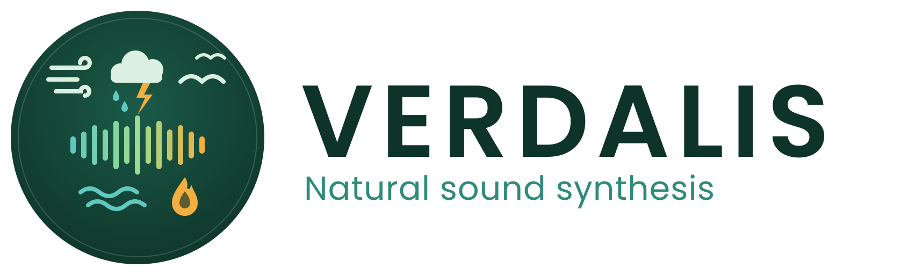

<p align="center">
  <picture>
    <source media="(prefers-color-scheme: dark)" srcset="_designs/verdalis-logo-horizontal-dark.svg">
    <source media="(prefers-color-scheme: light)" srcset="_designs/verdalis-logo-horizontal.svg">
    
  </picture>
</p>

<p align="center">
  <strong>A suite of native CLAP and VST3 instruments that synthesise the weather —<br>
  and one that synthesises the effects you cut it with.</strong><br>
  Every sound the instruments make is computed at run time.
</p>

---

Verdalis is a family of audio plugins built around a single rule: **nothing is
sampled.** Every sound is generated from noise, oscillators, filters and the
physical statistics of the phenomenon being modelled. No two instances ever
produce the same output.

Most of them model a natural sound source. **WhooshPact does not, and is not
meant to** — it is a production-effects instrument for transitions, impacts and
stings, built to the same synthesis-only rule and sharing the same foundation.
Treat it as an addition to the suite rather than as part of its nature
collection.

Each plugin is a self-contained instrument with its own synthesis engine, its
own factory presets — fitted against real reference recordings — and a
hand-drawn plugin window with no toolkit dependency. Every one ships as both a
**CLAP** and a **VST3**, for Linux and Windows; the two are the same plugin,
built from one implementation, so they share an engine, a parameter set, a
preset library and a window.

## The plugins

| Plugin | Simulates | Version |
|--------|-----------|---------|
| **[RainyDay](rainyday/)** — rain, from a single drip to a tropical monsoon | rain | 1.8.1 |
| **[ThunderClap](thunderclap/)** — thunder, from a distant rumble to an overhead strike | thunder | 1.5.1 |
| **[ShoreBreak](shorebreak/)** — ocean surf, from a distant roar to a shore in uproar | ocean waves | 0.2.1 |
| **[SkyHowl](skyhowl/)** — wind, from a soft breath to a howling storm | winds, storms | 0.2.1 |
| **[ChirpParade](chirpparade/)** — birds, from a single chirp to a dawn chorus | bird chirps | 0.6.1 |
| **[RiverFlow](riverflow/)** — running water, from a river's roar to one drop on stone | rivers, streams | 0.2.1 |
| **[CrackleBlaze](crackleblaze/)** — fire, from a cottage hearth to a burning roof | fire | 0.1.1 |
| **[InsectSwarm](insectswarm/)** — insects, from one bee to a hive, and cicadas to crickets | insects | 0.3.1 |
| **[NightLife](nightlife/)** — a night, from one wolf on a ridge to a pond full of frogs | night animals | 0.1.1 |
| **[WhooshPact](whooshpact/)** — transitions and impacts, from a passing whoosh to a cinematic boom | transitions, impacts *(not a natural source)* | 0.2.2 |

Every plugin shares the suite's visual language, its synthesis-only principle,
and a common DSP and GUI foundation.

**RainyDay** — rain, from one drip in an empty room to a monsoon on a tin roof.
Rain on leaves, on a windscreen, down a gutter, or heard as a wall of it from
half a mile away. Hold a note and it keeps falling for as long as you hold it,
never repeating, because every drop is worked out as it lands. 50 parameters,
17 presets, each one fitted against a real recording of the thing it imitates.

**ThunderClap** — thunder, from a rumble on the horizon to a strike that lands
on top of you. Distance is the main control and it does what distance really
does: the crack goes first, the low end survives, and a far-off bolt arrives
seconds after the flash. 47 parameters, 18 presets, and a window that lights up
with the bolt.

**ShoreBreak** — surf, from a distant roar to a shore in uproar. A wave is built
the way it actually breaks: the crest collapsing into a cloud of bubbles, the
foam it leaves behind, the wash running back down the beach, and single bubbles
popping in it. 52 parameters, 17 presets, and the four kinds of breaker
oceanographers name — which really do sound different, measurably so above
1.5 kHz.

**SkyHowl** — wind, from a breath through a gap to a storm. It is built on the
fact that wind itself is silent: what you hear is whatever it blows past. So the
plugin models the moving air, and the edges, wires and openings it drives — which
is why a howl swoops in pitch with every gust instead of just getting louder.
53 parameters, 23 presets, and rustling foliage as a layer of its own.

**ChirpParade** — birds, from a single chirp to a dawn chorus. A blackbird, a
robin, a nightingale, a woodpecker drumming on a dead branch. Play a note and
you get one call; hold it and the flock answers itself, each bird with its own
pitch, distance and position. 62 parameters, 18 presets, nine species, and 72
song shapes traced off real recordings and rebuilt from the tracing.

**RiverFlow** — running water, from a river's roar down to one drop falling on
stone. The plugin's odd discovery is that a smooth river really is just noise,
beautifully shaped — so half the work is the shaping, and the other half is the
grain: the stones, the dabbling, the drips off an overhang. Where that grain sits
in the spectrum is what tells a creek picking its way between stones from water
falling off a ledge. 50 parameters, 20 presets, built from 77 recordings.

**CrackleBlaze** — fire, from a cottage hearth to a burning roof. A fire is a
quiet bed with very loud, very short things on top, and the crackles are the
whole character: they never fall into a rhythm, they arrive in twos and threes
inside a hundredth of a second, and they flare and die away over seconds. They
are also dry clicks rather than little bell-like rings, so nothing here is made
to ring. 47 parameters, 18 presets, five fire colours taken from 17 recordings.

**InsectSwarm** — insects, from one bee against a window to a hive you can stand
next to. A wasp crossing the microphone, a mosquito that will not leave, cicadas
in the heat, crickets after dark. Count one insect or sixty: there is no separate
"swarm mode", because a crowd of them genuinely turns into noise on its own, the
way a real hive does. 54 parameters, 16 presets, seven species, all of them
fitted against 67 field recordings. Its cicadas and crickets are a mechanism of
their own, and 0.3.0 rebuilt what a *chorus* of them does in time: real callers
neither share a clock nor keep their own.

**NightLife** — a night: a wolf howling across a valley, an owl in a wood, a fox
screaming in a field, a loon over a lake, a pond full of frogs and a field of
crickets. Four layers, and each is built from a different kind of measurement,
because the things they model are different kinds of thing — a howl is a
frequency contour traced off a real animal, a croak is a pulse train through a
body resonance, and the pond they arrive in keeps time, because a measured frog
chorus is more regular than a random one and not less. 75 parameters, 16
presets, six callers and eight frogs, from 45 field recordings.

**WhooshPact** — the odd one out, and deliberately so: it models nothing in
nature. Whooshes, impacts, booms, braams, downshifters and stings — the sounds a
trailer or a title sequence needs. Its references are 211 finished production
sounds rather than field recordings, and the one thing they agree on is where
the punch sits in time, which is what the gesture controls are built around.
Every trigger comes out slightly different, which is the reason it exists.
64 parameters, 31 presets, six families.

## Build

Requires a C++17 compiler, CMake ≥ 3.16, and the CLAP headers (see below).
Linux is the primary target; Windows builds are produced by cross-compiling
with mingw-w64.

```sh
git clone https://github.com/Ravetracer/Verdalis.git
cd Verdalis
```

Then build a single plugin:

```sh
cd rainyday
./install.sh          # configure, build, self-test, install to ~/.clap
```

Or build the whole suite and pack the release archive:

```sh
./release.sh 0.23.0
```

That produces one `.zip`: every plugin, in both formats, for Linux and Windows
together. It is self-contained — the plugins, their presets, every manual as a
PDF, and install instructions for both platforms. Pass `--tarball` to get a
`.tar.gz` alongside.

## Documentation

Every plugin has a manual: what it models, how the synthesis works, a reference
for every parameter and every factory preset, and notes on using it in a host.
It ships as a PDF in the release archives, and its prose source is
`<plugin>/docs/manual.md`. Build one with:

```sh
shared/tools/make-manual.sh rainyday        # -> dist/manuals/
```

The parameter reference and the preset library are generated from the plugin
itself rather than written by hand, so they cannot drift from the build they
describe.

### SDKs

No SDK is included in this repository — they are third-party code and not ours
to redistribute. Check them out yourself into `CLAP/` beside the plugins, where
the build finds them automatically:

```sh
mkdir -p CLAP && cd CLAP

# required for a CLAP build
git clone https://github.com/free-audio/clap.git

# additionally required for a VST3 build
git clone https://github.com/free-audio/clap-wrapper.git
git clone --branch v3.8.1_build_84 https://github.com/steinbergmedia/vst3sdk.git
cd vst3sdk && git submodule update --init base pluginterfaces public.sdk && cd ..
```

The first repository is all that is required to build a CLAP. `CLAP/` is
gitignored. If you keep the CLAP SDK elsewhere, point CMake at it with
`-DCLAP_INCLUDE_DIR=/path/to/clap/include`.

The VST3 is produced by the [clap-wrapper](https://github.com/free-audio/clap-wrapper),
which hosts the same plugin behind the VST3 API — there is no separate VST3
codebase. It needs **VST 3.8 or newer**, the first MIT-licensed release of the
SDK; earlier ones are GPLv3 or a proprietary Steinberg agreement. The wrapper
needs one small patch to compile against 3.8, kept in `shared/patches/`.

VST is a trademark of Steinberg Media Technologies GmbH.

## Installing

CLAP plugins are loaded from `~/.clap` on Linux and
`%COMMONPROGRAMFILES%\CLAP` on Windows; VST3 bundles from `~/.vst3` and
`%COMMONPROGRAMFILES%\VST3`. Each plugin's `install.sh` installs the CLAP to the
right place by default, and `./install.sh --vst3` installs both. Release
archives ship with the same layout, so copying the folders in by hand works too.

Tested with Bitwig Studio and Reaper.

## How this was built

**These plugins were vibe coded.** The code was written with AI — Claude — doing
most of the typing, working from direction, reference recordings and listening
notes. That is worth saying plainly on the front page rather than leaving anyone
to work it out from the commit history.

It is not a claim that nothing was checked. Each model is fitted against real
reference recordings and the fit is measured: each plugin's `STATUS.md` records
what it was fitted to, which explanations were tested and discarded, and where
the model still falls short. Every build runs a self-test, every VST3 passes
Steinberg's validator, and nothing is accepted until it has been listened to
against the reference it imitates — a number agreeing with a number proves
nothing about how something sounds.

It is also free software given away as-is, tested by one person on Linux and
Windows in Bitwig Studio and Reaper. Reports from other hosts are welcome.

## License

Released under the terms in [LICENSE](LICENSE). Reference recordings and papers
used during development are not part of this repository and are not
redistributable.
